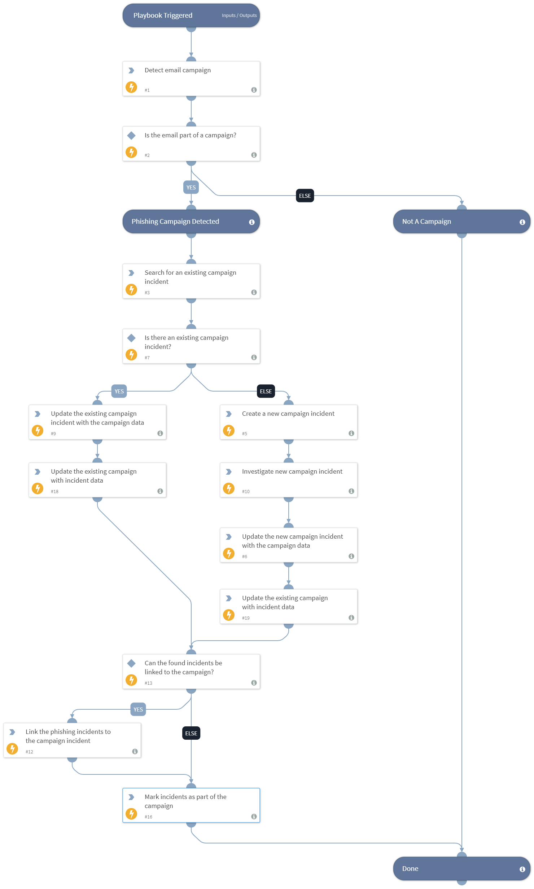

This playbook is used to find, create and manage phishing campaigns. When a number of similar phishing incidents exist in the system, the playbook can be used to:
1. Find and tie together incidents that are related to the same phishing attack (a phishing campaign).
2. Search for an existing Phishing Campaign incident or create a new one for the tied Phishing incidents.
3. Link all detected phishing incidents to the Phishing Campaign incident that was found or created previously.
4. Update the Phishing Campaign incident with the latest data about the campaign, and update all related phishing incidents to indicate that they are part of the campaign.

## Dependencies
This playbook uses the following sub-playbooks, integrations, and scripts.

### Sub-playbooks
This playbook does not use any sub-playbooks.

### Integrations
This playbook does not use any integrations.

### Scripts
* IsIncidentPartOfCampaign
* SetByIncidentId
* FindEmailCampaign_dev_itay

### Commands
* investigate
* createNewIncident
* linkIncidents
* setIncident

## Playbook Inputs
---

| **Name** | **Description** | **Default Value** | **Required** |
| --- | --- | --- | --- |
| AutomaticallyLinkIncidents | Whether to automatically link the incidents that make up the campaign, to the phishing campaign incident. Can be True or False. | True | Optional |
| incidentTypeFieldName | The name of the incident field in which the incident type is stored. Default is "type". Change this arguement only if you're using a custom field for specifying the incident type. | type | Optional |
| incidentTypes | A comma-separatetd list of incident types by which to filter. Specify "None" to search through all incident types. | Phishing | Optional |
| existingIncidentsLookback | The date from which to search for similar incidents. Date format is the same as in the incidents query page. For example: "3 days ago", "2019-01-01T00:00:00 \+0200". | 14 days ago | Optional |
| query | Additional text by which to query incidents. |  | Optional |
| limit | The maximum number of incidents to fetch. | 1000 | Optional |
| emailSubject | The name of the field that contains the email subject. | emailsubject | Optional |
| emailBody | The name of the field that contains the email body. | emailbody | Optional |
| emailBodyHTML | The name of the field that contains the HTML version of the email body. | emailbodyhtml | Optional |
| emailFrom | The name of the field that contains the email sender. | emailfrom | Optional |
| statusScope | Whether to compare the new incident to closed incidents, non closed incidents or all incidents. | All | Optional |
| threshold | Threshold to consider incident as similar. The range of values is 0-1. | 0.8 | Optional |
| maxIncidentsToReturn | The maximum number of incidents to display as part of a campaign. If a campaign includes a higher number of incidents, the results will contain only this amount of incidents. | 200 | Optional |
| minIncidentsForCampaign | Minimum number of incidents to consider as a campaign. | 3 | Optional |
| minUniqueRecipients | Minimum number of unique recipients of similar email incidents to consider as a campaign. | 2 | Optional |
| fieldsToDisplay | A comma-seperated list of fields to display. An example is "emailclassification,closereason". If a list of fields is provided, and a campaign is detected, these incidents fields will be displayed. Note - removing the "emailfrom", "recipients" or "severity" fields from this list will affect dynamic sections displayed in the campaign layout and render them useless. | id,name,emailfrom,recipients,severity,status,occurred | Optional |

## Playbook Outputs
---
There are no outputs for this playbook.

## Playbook Image
---
