Send messages and notifications to your Slack team.
This integration was integrated and tested with Slack.
## Configure SlackV3 on Cortex XSOAR

Slack V3 utilizes "Socket Mode" to enable the integration to communicate directly with Slack for mirroring. This requires a dedicated Slack app to be created for the XSOAR integration.


1. Navigate to **Settings** > **Integrations** > **Servers & Services**.
2. Search for SlackV3.
3. Click **Add instance** to create and configure a new integration instance.

    | **Parameter** | **Description** | **Required** |
    | --- | --- | --- |
    | `bot_token` | Slack API bot token. | False |
    | `app_token` | Slack API app token. | False |
    | `incidentNotificationChannel` | Dedicated Slack channel to receive notifications. | False |
    | `notify_incidents` | Send notifications about incidents to the dedicated channel. | False |
    | `min_severity` | Minimum incident severity to send messages to Slack by. | False |
    | `incidentType` | Type of incidents created in Slack. | False |
    | `allow_incidents` | Allow external users to create incidents via direct messages. | False |
    | `proxy` | Use system proxy settings. | False |
    | `unsecure` | Trust any certificate (not secure). | False |
    | `longRunning` | Long running instance. Required for investigation mirroring and direct messages. | False |
    | `bot_name` | Bot display name in Slack (Cortex XSOAR by default). | False |
    | `bot_icon` | Bot icon in Slack - Image URL (Cortex XSOAR icon by default). | False |
    | `max_limit_time` | Maximum time to wait for a rate limiting call in seconds. | False |
    | `paginated_count` | Number of objects to return in each paginated call. | False |
    | `proxy_url` | Proxy URL to use in Slack API calls. | False |
    | `filtered_tags` | Comma-separated list of tags by which to filter the messages sent from XSOAR. Only supported in Cortex XSOAR V6.1 and above. | False |

4. Click **Test** to validate the URLs, token, and connection.

### Creating a Custom App
1. Navigate to the following [link](https://api.slack.com/apps/).
 2. Click **Create an App**.
 
 3. Click **From an app manifest**.
 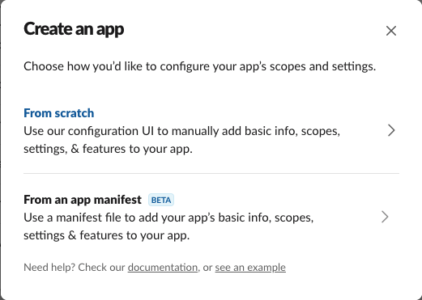
 4. Next pick the workspace you would like the app to reside in and click ***Next***.
 
 5. Next copy the text in the file found [here](https://raw.githubusercontent.com/demisto/content/master/Packs/Slack/doc_files/SlackV3_app_manifest.yml)
 6. Paste the copied text into the field "YAML" and click ***Next***.
 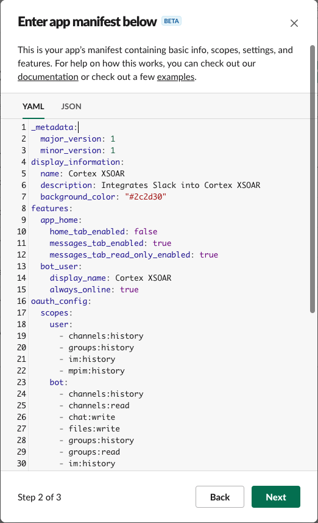
 7. The next step is a summary of the app we created. Click ***Create*** to proceed.
  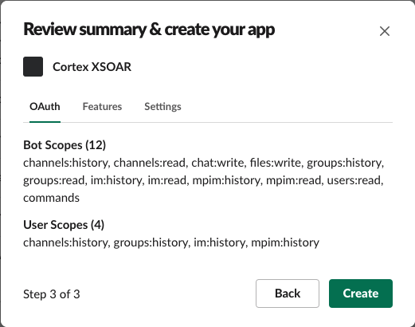
 
 ### Installing the App to Your Workspace
 1. After creating your app, you will be redirected to the *Basic Information* page of your app settings.
  First, click ***Install to Workspace***
 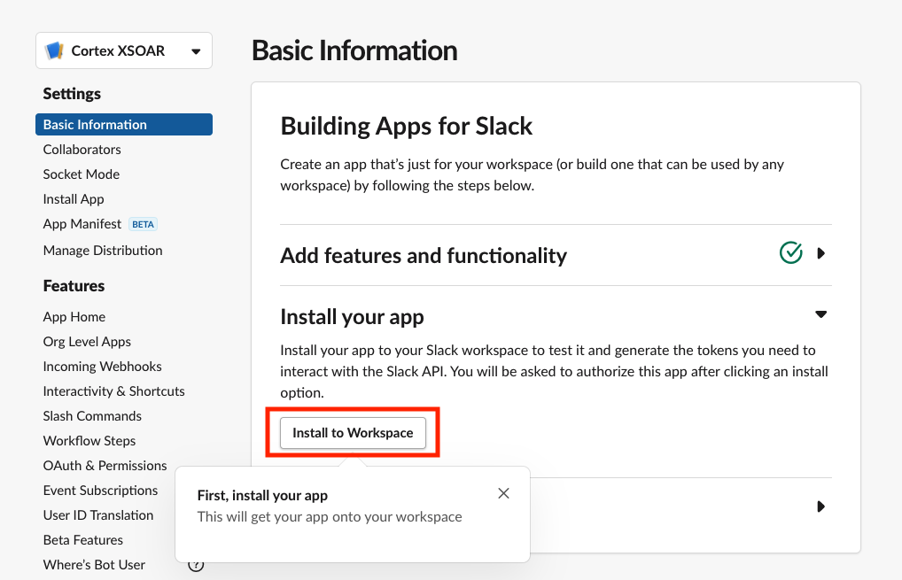
 2. This will bring up a page which confirms that you are installing the app to your workspace.
 **If you do not see this step, you must request access from your Slack admin in order to proceed.**
 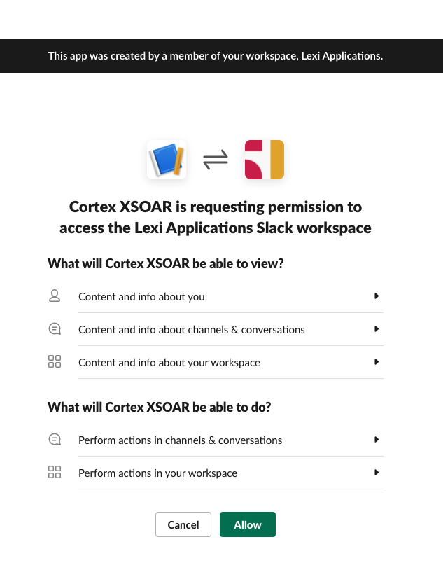
 3. Once the app has been installed you will be redirected to the ***General*** page for your app. Scroll down to the section called ***App-Level Tokens*** and click ***Generate Token and Scopes***
 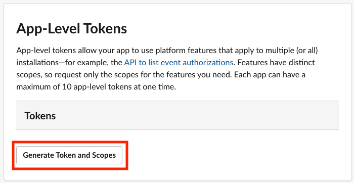 
 4. Enter a name for the Token and click ***Add Scope***. Select the `connections:write` scope from the list.
 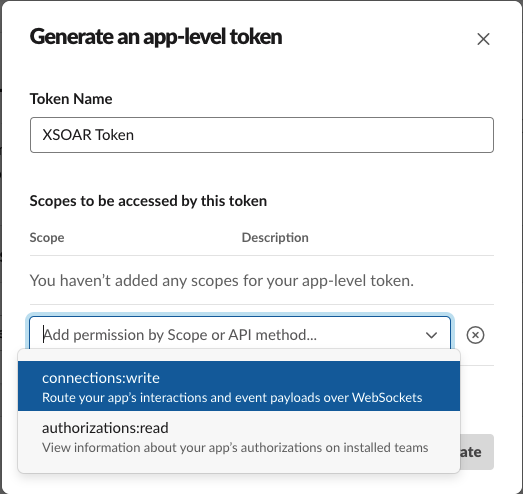 
 5. Click ***Generate***.
 6. After click ***Generate*** you will be redirected to a page which will display your app token. This token begins with `xapp`. Copy this token.
 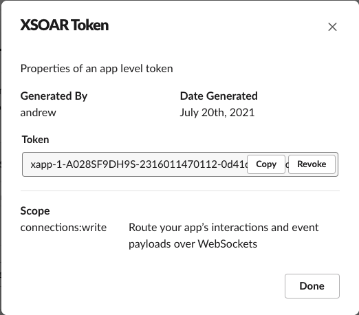
 7. In your XSOAR SlackV3 intance configuration page. Paste the token in the parameter *App Token*. You may also configure the *App Token* as a credential.
 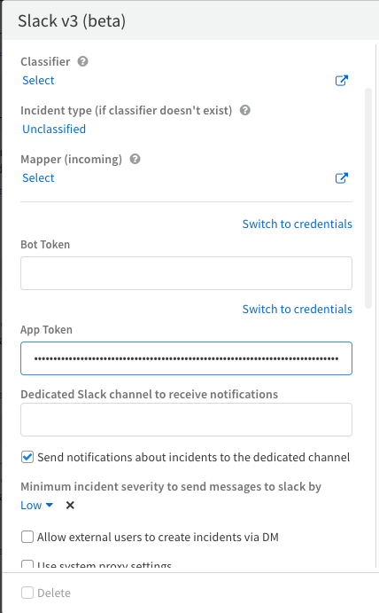
 8. Navigate back to the Slack App configuration page and select ***OAuth & Permissions***. If this screen does not look like the following image, you may need assistance from your Slack admin.
 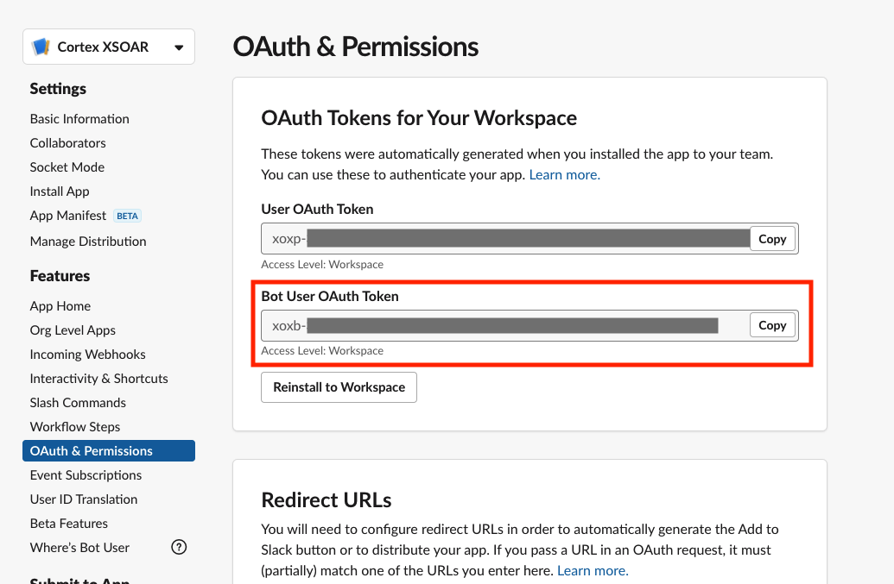
 9. Copy the ***Bot User OAuth Token***.
 10. In your XSOAR SlackV3 intance configuration page. Paste the token in the parameter *Bot Token*. You may also configure the *Bot Token* as a credential.
 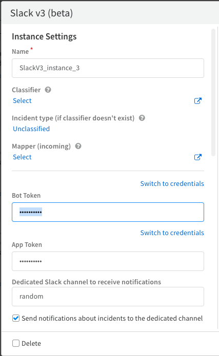
  
  
## Backwards Compatibility with Slack V2
Slack V3 currently contains improvements to enhance the stability of the integration as well as the circumvention of OProxy. This version is intended to provide customers with more granular control over the Slack integration by enabling the Bring-Your-Own-App model and customizable scope-based authentication.

All commands are fully compatible with Slack V2 playbooks as their inputs and outputs have remained the same. As a customer, you should notice no significant change in the behavior of the Slack integration with your existing playbooks.

## Commands
You can execute these commands from the Cortex XSOAR CLI, as part of an automation, or in a playbook.
After you successfully execute a command, a DBot message appears in the War Room with the command details.
### mirror-investigation
***
Mirrors the investigation between Slack and the Cortex XSOAR War Room.


#### Base Command

`mirror-investigation`
#### Input

| **Argument Name** | **Description** | **Required** |
| --- | --- | --- |
| type | The mirroring type. Can be "all", which mirrors everything, "chat", which mirrors only chats (not commands), or "none", which stops all mirroring. Possible values are: all, chat, none. Default is all. | Optional | 
| autoclose | Whether the channel is auto-closed when an investigation is closed. Can be "true" or "false". Default is "true". | Optional | 
| direction | The mirroring direction. Can be "FromDemisto", "ToDemisto", or "Both". Default value is "Both". | Optional | 
| mirrorTo | The channel type. Can be "channel" or "group". The default value is "group". | Optional | 
| channelName | The name of the channel. The default is "incident-&lt;incidentID&gt;". | Optional | 
| channelTopic | The topic of the channel. | Optional | 
| kickAdmin | Whether to remove the Slack administrator (channel creator) from the mirrored channel. Possible values are: true, false. Default is false. | Optional | 


#### Context Output

There is no context output for this command.

#### Command Example
```
!mirror-investigation direction="FromDemisto" channelName="example" using-brand="SlackV3"
```

#### Human Readable Output
>Investigation mirrored successfully, channel:example


### send-notification
***
Sends a message to a user, group, or channel.


#### Base Command

`send-notification`
#### Input

| **Argument Name** | **Description** | **Required** |
| --- | --- | --- |
| message | The message content. When mentioning another Slack user, make sure to do so in the following format: &lt;@user_name&gt;. | Optional | 
| to | The user to whom to send the message. Can be either the username or email address. | Optional | 
| channel | The name of the Slack channel to which to send the message. | Optional | 
| entry | An entry ID to send as a link. | Optional | 
| ignoreAddURL | Whether to include a URL to the relevant component in Cortex XSOAR. Can be "true" or "false". Default value is "false". | Optional | 
| threadID | The ID of the thread to which to reply. Can be retrieved from a previous send-notification command. | Optional | 
| blocks | A JSON string of Slack blocks to send in the message. | Optional | 


#### Context Output

| **Path** | **Type** | **Description** |
| --- | --- | --- |
| Slack.Thread.ID | String | The Slack thread ID. | 


#### Command Example
```!send-notification channel="example" using-brand="SlackV3"```

#### Context Example
```json
{
    "Slack": {
        "Thread": {
            "ID": "1624272821.000700"
        }
    }
}
```

#### Human Readable Output

>Message sent to Slack successfully.
>Thread ID is: 1624272821.000700

### close-channel
***
Archives a Slack channel.


#### Base Command

`close-channel`
#### Input

| **Argument Name** | **Description** | **Required** |
| --- | --- | --- |
| channel | The name of the channel to archive. If not provided, the mirrored investigation channel is archived (if the channel exists). | Optional | 


#### Context Output

There is no context output for this command.

#### Command Example
```
!close-channel channel=new-slack-channel
```

#### Human Readable Output
>Channel successfully archived.


### slack-send-file
***
Sends a file to a user, channel, or group. If not specified, the file is sent to the mirrored investigation channel (if the channel exists).


#### Base Command

`slack-send-file`
#### Input

| **Argument Name** | **Description** | **Required** |
| --- | --- | --- |
| file | The ID of the file entry to send. | Required | 
| to | The user to whom to send the file. Can be the username or the email address. | Optional | 
| group | The name of the Slack group (private channel) to which to send the file. | Optional | 
| channel | The name of the Slack channel to which to send the file. | Optional | 
| threadID | The ID of the thread to which to reply. Can be retrieved from a previous send-notification command. | Optional | 
| comment | A comment to add to the file. | Optional | 


#### Context Output

There is no context output for this command.

#### Command Example
```
!slack-send-file file=87@129 channel=testing-docs comment="Look at this gif!"
```

#### Human Readable Output
>File sent to Slack successfully.


### slack-set-channel-topic
***
Sets the topic for a channel.


#### Base Command

`slack-set-channel-topic`
#### Input

| **Argument Name** | **Description** | **Required** |
| --- | --- | --- |
| channel | The channel name. If not specified, the topic of the mirrored investigation channel is set (if the channel exists). | Optional | 
| topic | The topic for the channel. | Required | 


#### Context Output

There is no context output for this command.

#### Command Example
```
!slack-set-channel-topic topic="Testing topic for documentation" channel=testing-docs
```

#### Human Readable Output
>Topic successfully set.


### slack-create-channel
***
Creates a channel in Slack.


#### Base Command

`slack-create-channel`
#### Input

| **Argument Name** | **Description** | **Required** |
| --- | --- | --- |
| type | The channel type. Can be "private" or "public". Default is private. | Optional | 
| name | The name of the channel. | Required | 
| users | A CSV list of user names or email addresses to invite to the channel. For example: "user1, user2...". | Optional | 


#### Context Output

There is no context output for this command.

#### Command Example
```
!slack-create-channel type="private" name="testing-docs"
```

#### Human Readable Output
>Successfully created the channel testing-docs


### slack-invite-to-channel
***
Invites users to join a channel.


#### Base Command

`slack-invite-to-channel`
#### Input

| **Argument Name** | **Description** | **Required** |
| --- | --- | --- |
| users | A CSV list of usernames or email addresses to invite to join the channel. For example: "user1, user2...". | Required | 
| channel | The name of the channel to which to invite the users. If the name of the channel is not specified, the name of the mirrored investigation channel is used (if the channel exists). | Optional | 


#### Context Output

There is no context output for this command.

#### Command Example
```
!slack-invite-to-channel users="Sir Testing McTesterface" channel=new-slack-channel
```

#### Human Readable Output
>Successfully invited users to the channel.


### slack-kick-from-channel
***
Removes users from the specified channel.


#### Base Command

`slack-kick-from-channel`
#### Input

| **Argument Name** | **Description** | **Required** |
| --- | --- | --- |
| users | A CSV list of usernames or email addresses to remove from the a channel. For example: "user1, user2...". | Required | 
| channel | The name of the channel from which to remove the users. If the name of the channel is not specified, the mirrored investigation channel is used (if the channel exists). | Optional | 


#### Context Output

There is no context output for this command.

#### Command Example
```
!slack-kick-from-channel users="Sir Testing McTesterface" channel=new-slack-channel
```

#### Human Readable Output
>Successfully kicked users from the channel.


### slack-rename-channel
***
Renames a channel in Slack.


#### Base Command

`slack-rename-channel`
#### Input

| **Argument Name** | **Description** | **Required** |
| --- | --- | --- |
| name | The new name of the channel. | Required | 
| channel | The current name of the channel. If the name of the channel is not specified, the mirrored investigation channel is used (if the channel exists). | Optional | 


#### Context Output

There is no context output for this command.

#### Command Example
```
!slack-rename-channel name="new-slack-channel" channel="testing-docs"
```

#### Human Readable Output
>Channel renamed successfully.


### slack-get-user-details
***
Get details about a specified user.


#### Base Command

`slack-get-user-details`
#### Input

| **Argument Name** | **Description** | **Required** |
| --- | --- | --- |
| user | The Slack user (username or email). | Required | 


#### Context Output

| **Path** | **Type** | **Description** |
| --- | --- | --- |
| Slack.User.ID | String | The ID of the user. | 
| Slack.User.Username | String | The username of the user. | 
| Slack.User.Name | String | The actual name of the user. | 
| Slack.User.DisplayName | String | The display name of the user. | 
| Slack.User.Email | String | The email address of the user. | 


#### Command Example
```!slack-get-user-details user="cortex_xsoar" using-brand="SlackV3"```

#### Context Example
```json
{
    "Slack": {
        "User": {
            "ID": "U0XXXXXXXX",
            "Name": "cortex_xsoar",
            "Username": "demisto_integration"
        }
    }
}
```

#### Human Readable Output

>### Details for Slack user: cortex_xsoar
>|ID|Username|Name|
>|---|---|---|
>| U0XXXXXXXX | demisto_integration | cortex_xsoar |

